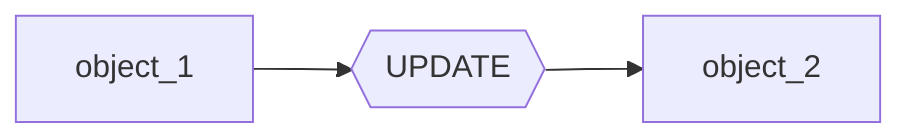

# **Reactive Programming**
Magma is built on the reactive programming principles, as such, you need to know what exactly is reactive programming, so that you can leverage Magma's features to it's best. 
_______
## **It's all about Events**
In Reactive Programming, we manage data using "events", or more simply enough "notifications" from an object to another depending on the context.

If we were to build a simple kills-cash leaderstats, we would first have a variable called `kills` and another called `cash`. 

Now, no matter how you want to calculate, either by a static value *(kills * 200)* or a dynamic value *(kills * random)*, you would always need to bind the cash to the kills variable. With Magma *(aka, reactive programming)*, we would use the `ReGem` and the `Gems` objects, and it would look like this:

```Lua

local kills = Gem(1)
local cash = ReGem(function(use)
    return use(kills) * 200
end)
```

Now everything is clear at the first glance, and quite frankly, we have now a variable that is synced to to another!

Now, when we change `kills`, it will update `cash`, like the following:

```lua

kills:set(20)
print(kills:get()) -- 20,000
```
Internally, when you use the `set()` method, `kills` will send a notification to `cash`, at which `cash` responds by upating itself, which we can express in a diagram like this:



??? Caution "Real Behavior"
    The actual behavior in Magma is that for example `kills` doesn't send "notification", but rather directly updates them instead. This difference is minor and doesn't change how you would code with Magma.


________

## **Worry about data, not updates**
The beauty about reactive programming, especially when used in Magma, is that you shouldn't worry about updating your variables when their dependencies update. consider the following lua code:

```Lua

local var_1 = 24
local var_2 = var_1 * 2
```

This would only work once, because if you were to update var_1, you would manually need to update var_2 too. This is easy to fix in this example, but in larger codebases, it is very tedious to fix.
_______


In  this page, you were introduced to Reactive programming, a paradigm that let's you declare how your variables react to each other.